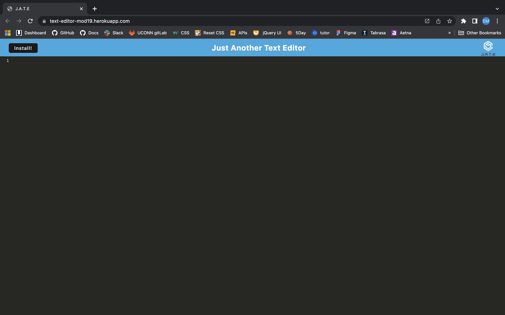

# Mod-19-text-editor
This is a basic text editor that can be used to take notes on or offline.

## User Story
AS A developer
I WANT to create notes or code snippets with or without an internet connection
SO THAT I can reliably retrieve them for later use

## Table of Contents

- [Installation](#installation)
- [Screenshot](#screenshot)
- [Links](#links)
- [Acknowledgements](#acknowledgements)

## Installation
This application can be used by clicking this [link](https://text-editor-mod19.herokuapp.com/).
 
Alternatively, a user could clone the GitHub [repo](https://github.com/EmilyBernard/Mod-19-text-editor), run 'npm install' in the VS code command line, then 'npm run start' when installation is done.  This will run the application on localhost:3000. 

## Screenshot

## Links
https://text-editor-mod19.herokuapp.com/
 

https://github.com/EmilyBernard/Mod-19-text-editor
 

## Acknowledgements
<li>All activity files and mini-challenge from week 19
<li>Challenge instructions and TODO's in starter code.
